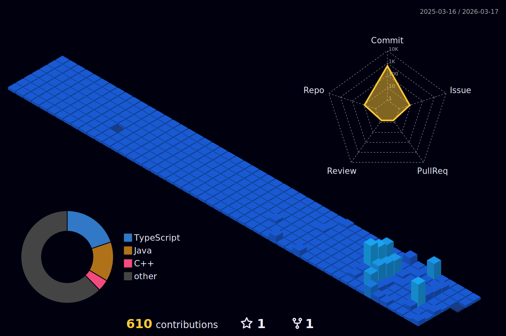

<!--
**nawaraing/nawaraing** is a ✨ _special_ ✨ repository because its `README.md` (this file) appears on your GitHub profile.
-->

## Career & Education

### 💻 Korea IT Academy
###### ( 2023.11 ~ 2024.05 )

### 💼 C-ondream Ltd.
###### ( 2021.07 ~ 2023.05 )

### 🖥️ 42Seoul
###### ( 2019.12 ~ 2021.07 )

### 🏫 Department of Mathematics at Inha University
###### ( 2014.03 ~ 2022.02 )

## My Skill

### Framework & Library

  
  
  

### Language

   
  
  
  

### DBMS

  
  
  

### OS

  
  
  

### etc

  
  

## Algorithm

  
<!--    -->

## Contribution

<!--  -->

## Contacts

