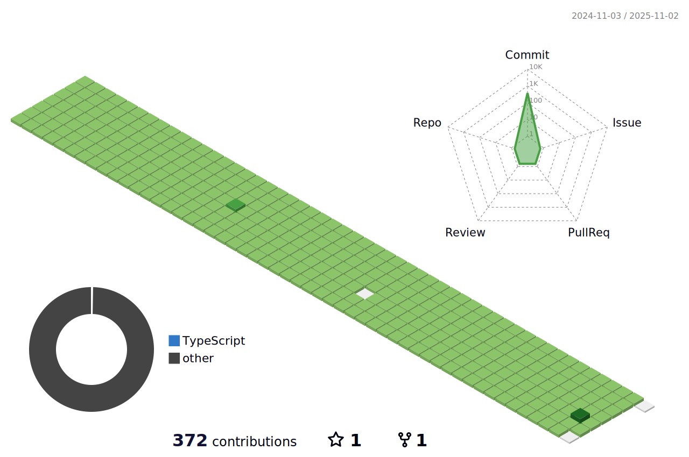

<!--
**nawaraing/nawaraing** is a ✨ _special_ ✨ repository because its `README.md` (this file) appears on your GitHub profile.
-->
<!--방문자수-->

  

 
 

## Main Language 

 

## My Skill

   
  
  

  

## Contacts

