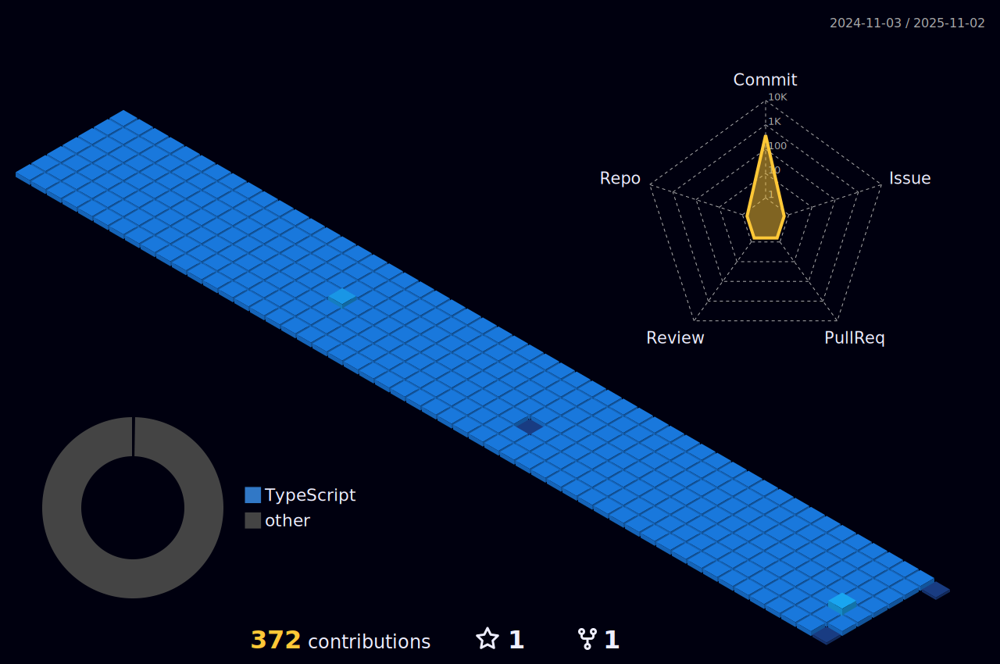

<!--
**nawaraing/nawaraing** is a ✨ _special_ ✨ repository because its `README.md` (this file) appears on your GitHub profile.
-->
<!--방문자수-->

 

## My Skill

### Language

   
  
  

### DBMS

  
  
  

### OS

  
  
  

### etc

  

## Contribution

## Contacts

